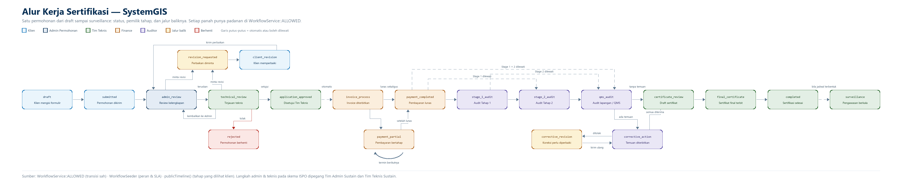
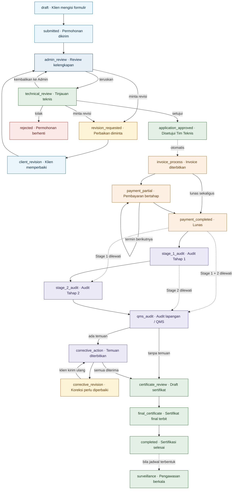

# Alur Kerja Sertifikasi

Satu permohonan ditelusuri dari `draft` sampai `surveillance`: siapa memegang
tahap mana, status apa yang berlaku, dan ke mana saja jalur baliknya.

Alur ini punya tiga definisi yang saling melengkapi di dalam kode, dan dokumen
ini menggabungkan ketiganya:

| Sumber | Yang didefinisikan |
|---|---|
| `app/Services/WorkflowService.php:14-39` | Peta `ALLOWED` — satu-satunya daftar transisi status yang sah |
| `database/seeders/WorkflowSeeder.php:31-41` | 9 langkah kerja: peran pemilik, SLA, dan langkah yang boleh dilewati |
| `app/Services/WorkflowService.php:161-192` | `publicTimeline()` — 9 tahap yang dilihat klien pada halaman pelacakan |

Tidak ada panah pada diagram di bawah yang tidak punya padanan di `ALLOWED`.

## Diagram

Versi gambar untuk bahan presentasi (4500 × 940 px):

Versi draw.io untuk disunting sendiri: [`alur-kerja-sertifikasi.drawio`](alur-kerja-sertifikasi.drawio)
— buka lewat <https://app.diagrams.net> atau ekstensi Draw.io Integration di VS Code.
XML-nya sengaja tidak dikompresi supaya bisa dibaca dan di-`diff` seperti berkas
teks biasa.

Versi Mermaid, untuk disunting bila alurnya berubah:

## Tahap, pemilik, dan SLA

Sembilan langkah kerja beserta perannya, dari `WorkflowSeeder.php:31-41`:

| # | Langkah | Pemilik | SLA | Tahap publik |
|---|---|---|---|---|
| 1 | Application Form | Klien | 14 hari | Permohonan |
| 2 | Review Admin & Tinjauan | Admin Permohonan | 5 hari | Permohonan |
| 3 | Invoice & Pembayaran | Finance | 7 hari | Invoice & Pembayaran |
| 4 | Stage 1 Audit | Auditor | 10 hari | Audit Tahap 1 |
| 5 | Stage 2 Audit | Auditor | 15 hari | Audit Tahap 2 |
| 6 | QMS / Audit Lapangan | Auditor | 15 hari | Audit Lapangan / QMS |
| 7 | Corrective Action | Auditor | 30 hari | Tindakan Koreksi |
| 8 | Draft Certificate Review | Tim Teknis | 7 hari | Review Sertifikat |
| 9 | Sertifikat Final | Tim Teknis | 7 hari | Sertifikat Final |

Tahap **Surveillance** tidak punya langkah kerja tersendiri; ia diaktifkan
otomatis setelah sertifikasi selesai bila jadwalnya sudah terbentuk.

## Dua hal yang mudah salah dibaca

**Keputusan akhir ada di Tim Teknis, bukan Admin Permohonan.** Admin mengkaji
kelengkapan lalu meneruskan; hanya `technical_review` yang bisa mencapai
`application_approved` maupun `rejected`. Keduanya sama-sama boleh meminta
revisi ke klien. Lihat `WorkflowService.php:17-24`.

**ISPO dipegang tim yang berbeda.** Langkah admin dan teknis untuk skema ISPO
menjadi tanggung jawab `admin_sustain` dan `technical_sustain`, bukan
`admin_application` dan `technical`. Pemetaannya hidup di
`config/scheme_ownership.php` dan dibaca lewat `SchemeOwnershipService`
(`WorkflowSeeder.php:22-23`). Mengakses order ISPO dengan akun non-Sustain akan
ditolak 403.

## Langkah yang boleh dilewati

Stage 1 dan Stage 2 tidak berlaku sama untuk semua skema
(`WorkflowSeeder.php:29-30`):

| Kategori skema | Skema | Stage 1 | Stage 2 |
|---|---|---|---|
| Sistem manajemen | ISO 9001, 14001, 45001, 27001, 20000, 37001, 37301 | Wajib | Wajib |
| Keamanan pangan | ISO 22000, HACCP | Wajib | Wajib |
| Produk (LSPro) | SNI, SNI Lokal, SNI Impor | Boleh dilewati | Boleh dilewati |
| ISPO | ISPO | Boleh dilewati | Wajib |

Melewati sebuah tahap tetap menuntut alasan tertulis dan tanggal tindakan, dan
tercatat di riwayat status sebagai `audit_stage_skipped`
(`AuditController.php:173`).

## Perpindahan otomatis

Dua perpindahan terjadi tanpa ada orang yang menekan tombol keduanya:

- `application_approved` → `invoice_process`, langsung setelah Tim Teknis
  menyetujui dan PDF tinjauan selesai dibuat (`TechnicalController.php:270`)
- `completed` → `surveillance`, hanya bila jadwal surveillance sudah terbentuk
  dari sertifikat final (`TechnicalController.php:450`)

## Akun demo untuk menelusuri alur

Dibuat `SystemAccountsSeeder`, hanya pada environment `local`/`testing` dan
hanya bila `SYSTEMGIS_SEED_DEMO_ACCOUNTS=true`. Password seluruh akun diambil
dari `SYSTEMGIS_DEMO_PASSWORD` di `.env`.

| Email | Peran | Tahap yang dipegang |
|---|---|---|
| `client@systemgis.local` | Klien | Isi, kirim, dan perbaiki permohonan |
| `admin.application@systemgis.local` | Admin Permohonan | Review admin (selain ISPO) |
| `admin.sustain@systemgis.local` | Tim Admin Sustain | Review admin ISPO |
| `finance@systemgis.local` | Finance | Invoice & pembayaran |
| `auditor@systemgis.local` | Auditor | Stage 1, Stage 2, QMS, tindakan koreksi |
| `technical@systemgis.local` | Tim Teknis | Tinjauan teknis sampai sertifikat (selain ISPO) |
| `technical.sustain@systemgis.local` | Tim Teknis Sustain | Rantai penuh ISPO |
| `superadmin@systemgis.local` | Superadmin | Master data, termasuk acuan IAF/NACE |
